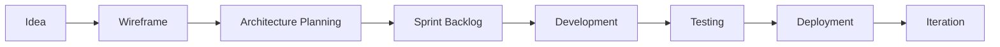

# 👋 Hi, I'm K. Kavindu Lakshan

### Full-Stack Web & Mobile Developer | Aspiring Game Developer | Computer Science Undergraduate

 

---

## 👨‍💻 About Me

I am **K. Kavindu Lakshan**, a **Level 3 Computer Science undergraduate at the University of Ruhuna**, focused on building reliable, scalable, and user-friendly digital products.

I work across **full-stack web development**, **cross-platform mobile applications**, **offline-first business systems**, and I am actively exploring **game development** and **AI-powered RAG chatbot architectures**.

My development style is **design-first, architecture-focused, and Scrum-driven**, allowing me to plan clean workflows before writing production code.

---

## 🚀 Current Focus

<table>
<tr>
<td width="50%" valign="top">

### 🛒 Flux POS & Inventory System

A commercial-grade, offline-first **Retail POS & Inventory System** built for high-volume retail environments.

**Core focus areas:**

- Fast front-counter checkout workflow
- Branch-isolated architecture
- Accurate inventory handling
- Back-office reporting accuracy
- PostgreSQL-backed data management

</td>
<td width="50%" valign="top">

### 🧠 Learning & Research

Currently improving my skills in:

- Advanced RAG pipelines
- AI chatbot implementation
- Modern game engines
- Interactive UI prototyping
- Scalable backend architecture
- Offline-first synchronization patterns

</td>
</tr>
</table>

---

## 🛠️ Tech Stack

### Frontend Development

 

### Backend & Databases

 

### Mobile, Tools & Design

---

## 📌 Featured Projects

<table>
<tr>
<td width="33%" valign="top">

### 🛒 Flux

**Retail POS & Inventory System**

A commercial-grade system designed for high-volume retail environments with strong branch isolation, accurate inventory handling, and reliable back-office reporting.

**Stack:** Next.js, Node.js, PostgreSQL

</td>
<td width="33%" valign="top">

### 🚗 Smart Auto Hub

**Vehicle Dealership Platform**

A complete vehicle dealership platform containing a desktop-responsive web application paired with a Flutter-based Android app for streamlined vehicle consultation workflows.

**Stack:** Web App, Flutter, Mobile App

</td>
<td width="33%" valign="top">

### 📅 MediReminder

**Multi-platform Reminder App**

A cloud-connected utility app concept using Supabase, Firebase, and GCP-based architecture for reliable multi-platform medicine reminder workflows.

**Stack:** Flutter, Supabase, Firebase, GCP

</td>
</tr>
</table>

---

## 📊 Live GitHub Analytics

 

---

## 🏆 GitHub Achievements

---

## 📈 Contribution Activity

---

## 🧩 Development Workflow

---

## 🤝 Collaboration Interests

I am open to collaborating on:

- Full-stack web applications
- Offline-first business platforms
- Open-source tools
- Indie game development
- AI chatbot and RAG-based systems
- Modern UI/UX prototype-driven projects

---

## 🌐 Connect With Me

---

### ✨ Building practical software with clean architecture, strong UI, and reliable user experience.

