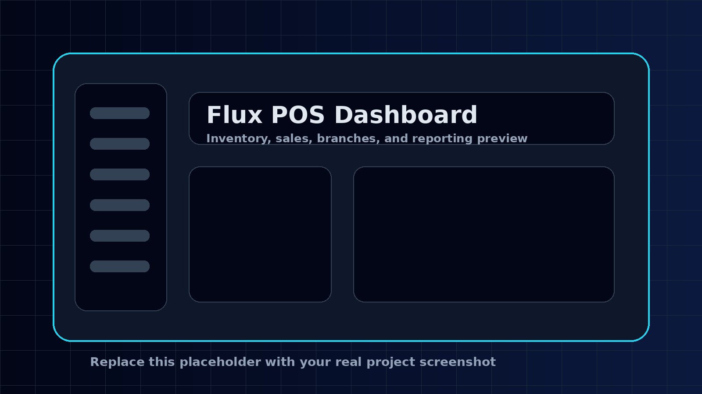
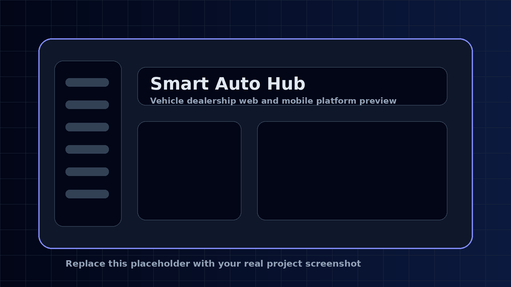
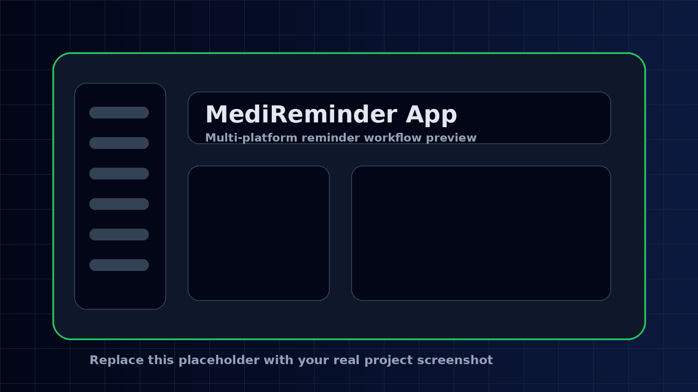
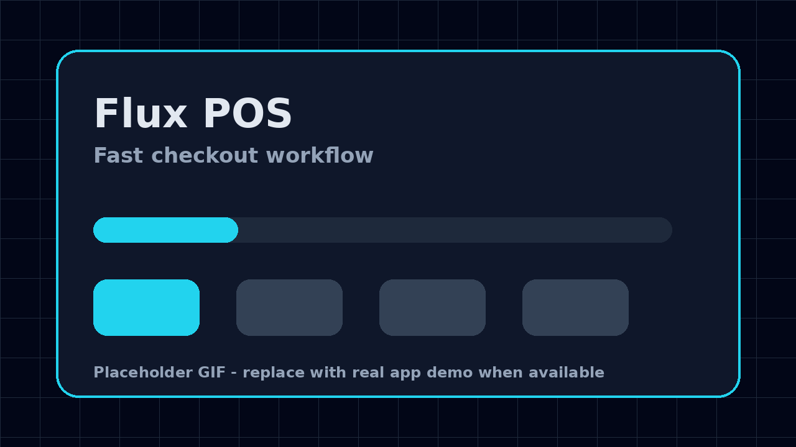
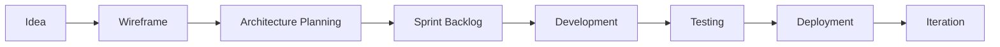

 

 

---

## 👨‍💻 About Me

I am **K. Kavindu Lakshan**, a **Level 3 Computer Science undergraduate at the University of Ruhuna**, focused on building reliable, scalable, and user-friendly digital products.

I work across **full-stack web development**, **cross-platform mobile applications**, **offline-first business systems**, and I am actively exploring **game development** and **AI-powered RAG chatbot architectures**.

My development style is **design-first, architecture-focused, and Scrum-driven**, allowing me to plan clean workflows before writing production code.

---

## ⚡ Live Profile Snapshot

<!-- PROFILE-DATA:START -->
| Metric | Value |
|---|---:|
| Public Repositories | 36 |
| Followers | 1 |
| Following | 2 |
| Total Public Repo Stars | 2 |
| Total Public Repo Forks | 0 |
| Last Auto Update | 2026-07-11 03:13:28 UTC |
<!-- PROFILE-DATA:END -->

---

## 🚀 Current Focus

<table>
<tr>
<td width="50%" valign="top">

### 🛒 Flux POS & Inventory System

A commercial-grade, offline-first **Retail POS & Inventory System** built for high-volume retail environments.

**Core focus areas:**

- Fast front-counter checkout workflow
- Branch-isolated architecture
- Accurate inventory handling
- Back-office reporting accuracy
- PostgreSQL-backed data management

</td>
<td width="50%" valign="top">

### 🧠 Learning & Research

Currently improving my skills in:

- Advanced RAG pipelines
- AI chatbot implementation
- Modern game engines
- Interactive UI prototyping
- Scalable backend architecture
- Offline-first synchronization patterns

</td>
</tr>
</table>

---

## 🛠️ Tech Stack

### Frontend Development

 

### Backend & Databases

 

### Mobile, Tools & Design

---

## 📌 Featured Projects

<table>
<tr>
<td width="33%" valign="top">

### 🛒 Flux

**Retail POS & Inventory System**

A commercial-grade system designed for high-volume retail environments with strong branch isolation, accurate inventory handling, and reliable back-office reporting.

**Stack:** Next.js, Node.js, PostgreSQL

</td>
<td width="33%" valign="top">

### 🚗 Smart Auto Hub

**Vehicle Dealership Platform**

A complete vehicle dealership platform containing a desktop-responsive web application paired with a Flutter-based Android app for streamlined vehicle consultation workflows.

**Stack:** Web App, Flutter, Mobile App

</td>
<td width="33%" valign="top">

### 📅 MediReminder

**Multi-platform Reminder App**

A cloud-connected utility app concept using Supabase, Firebase, and GCP-based architecture for reliable multi-platform medicine reminder workflows.

**Stack:** Flutter, Supabase, Firebase, GCP

</td>
</tr>
</table>

---

## 🎬 Flux Demo Preview

---

## 🆕 Latest Public Repositories

<!-- LATEST-REPOS:START -->
- [**KavinduLakshan393**](https://github.com/KavinduLakshan393/KavinduLakshan393) - No description provided yet. `JavaScript` | ⭐ 0 | 🍴 0
- [**pomodoro-task-tracker**](https://github.com/KavinduLakshan393/pomodoro-task-tracker) - No description provided yet. `PowerShell` | ⭐ 0 | 🍴 0
- [**Full-JavaScript-Beginner-Curriculum**](https://github.com/KavinduLakshan393/Full-JavaScript-Beginner-Curriculum) - Beginner-friendly JavaScript curriculum with 27 structured sprint notes covering core JavaScript, DOM, accessibility, forms, APIs, debugging, regex, data structures, dynamic programming, and asynchronous programming. `Mixed` | ⭐ 0 | 🍴 0
- [**Full-React-Begineer-curriculum**](https://github.com/KavinduLakshan393/Full-React-Begineer-curriculum) - A comprehensive React curriculum covering fundamentals, hooks, routing, state management, performance optimization, and testing. Organized in 16 progressive sprints with detailed structured notes. `Mixed` | ⭐ 0 | 🍴 0
- [**projects**](https://github.com/KavinduLakshan393/projects) - No description provided yet. `HTML` | ⭐ 0 | 🍴 0
- [**internSift**](https://github.com/KavinduLakshan393/internSift) - No description provided yet. `TypeScript` | ⭐ 0 | 🍴 0
<!-- LATEST-REPOS:END -->

---

## 📊 Live GitHub Analytics

 

---

## 🏆 GitHub Achievements

---

## 📈 Contribution Activity

---

## 🐍 Contribution Snake

<picture>
  <source media="(prefers-color-scheme: dark)" srcset="https://raw.githubusercontent.com/KavinduLakshan393/KavinduLakshan393/output/github-contribution-grid-snake-dark.svg" />
  <source media="(prefers-color-scheme: light)" srcset="https://raw.githubusercontent.com/KavinduLakshan393/KavinduLakshan393/output/github-contribution-grid-snake.svg" />
  
</picture>

---

## 🧩 Development Workflow

---

## 🤝 Collaboration Interests

I am open to collaborating on:

- Full-stack web applications
- Offline-first business platforms
- Open-source tools
- Indie game development
- AI chatbot and RAG-based systems
- Modern UI/UX prototype-driven projects

---

## 📄 Resume

> Replace the placeholder CV file in `assets/Kavindu_Lakshan_CV.pdf` with your real updated CV before sharing professionally.

---

## 🌐 Connect With Me

---

### ✨ Building practical software with clean architecture, strong UI, and reliable user experience.

